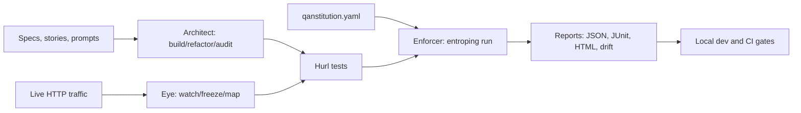
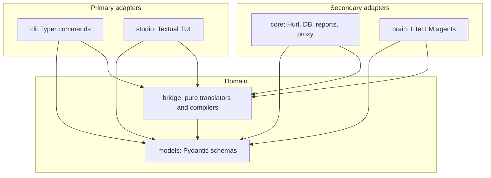

# Entroping

**Code at the speed of AI. Don't crash at the speed of AI.**

[](https://scorecard.dev/viewer/?uri=github.com/sakibshuvo/Entroping)

Entroping is a local-first runtime governance layer for AI-assisted backend
development. Let agents generate code, propose tests, and refactor APIs; keep
the merge decision deterministic with Hurl, executable policy gates, and
CI-ready reports.

The core rule is simple: **AI can suggest. Runtime truth decides.**

## Why Entroping

AI can now ship backend changes faster than humans can fully review them. The
hard failures rarely show up in static review: wrong status codes, broken auth,
schema drift, undocumented dependencies, slow endpoints, and "looks fine" code
that quietly breaks production behavior.

Entroping gives that workflow a hard guardrail:

- **QAnstitution is Law:** define security, latency, schema, and ownership rules once.
- **Traffic is Truth:** capture real HTTP behavior and freeze it into regression coverage.
- **Hurl is the Enforcer:** execute committed `.hurl` tests through a deterministic Rust binary.
- **CI stays LLM-free:** generation can use AI, but `entroping run` is reproducible.

## Try It In Two Minutes

Clone the repo, install dev dependencies, and run the live checkout demo:

```bash
git clone https://github.com/sakibshuvo/Entroping.git
cd Entroping
uv sync --dev
brew install hurl # macOS; use your package manager elsewhere
scripts/live_demo_smoke.sh
```

Expected proof:

```text
Hurl run: 4 passed, 0 failed
Wrote report: reports/run-latest.json
Wrote report: reports/junit.xml
Wrote report: reports/run-latest.html
```

For public launch previews, use the
[Two-Minute Demo Assets](docs/assets/launch/README.md):

- [Terminal demo screenshot](docs/assets/launch/terminal-demo-screenshot.png)
  from `scripts/live_demo_smoke.sh`.
- [HTML report screenshot](docs/assets/launch/html-report-screenshot.png)
  captured from `reports/run-latest.html`.
- [Dependency map screenshot](docs/assets/launch/dependency-map-screenshot.png)
  generated from redacted traffic state.

## What You Get

Entroping is not another AI chat wrapper. It is an execution boundary for API
quality:

- Turn OpenAPI specs into reviewable Hurl regression tests.
- Inject global QAnstitution gates into every run without mutating source tests.
- Capture and redact live traffic, then freeze flows or dependency mocks.
- Emit JSON, JUnit, HTML, drift, bug, and traceability reports for local review and CI.



## Current Alpha

This repository is the active alpha implementation and Obsidian-friendly
knowledge base for Entroping.

Public roadmap: [ROADMAP.md](ROADMAP.md) and
[GitHub Project board](https://github.com/users/sakibshuvo/projects/1).

Built today:

- Locked v4.1 CLI surface for `init`, `doctor`, `config`, `architect`, `watch`,
  `freeze`, `map`, `run`, `studio`, and `report`.
- QAnstitution loading with safe local imports, typed condition validation,
  duplicate gate checks, and final imported gate protection.
- Hurl discovery, metadata parsing, tag filters, gate matching, temporary
  execution-copy injection, subprocess timeouts, output redaction, and bounded
  parallel execution.
- JSON, JUnit, HTML, drift, bug, and traceability reporting.
- Deterministic OpenAPI-to-Hurl generation plus Architect prompt build,
  merge, refactor, audit, persona loading, LiteLLM routing, structured output
  parsing, and pre-write Hurl validation.
- Eye capture/freeze/map foundation with mitmproxy capture, SQLModel-backed
  SQLite state, redaction before persistence, generated Hurl flows, WireMock
  mappings, and Mermaid/DOT/Markdown/PNG dependency maps.
- Local and CI quality gates through `uv`, `ruff`, `mypy`, `pytest`, coverage,
  package verification, security checks, live demo smoke, and quality audit.

Still alpha:

- Dependency-call drift is route-level only: host, method, and templated path,
  with no raw traffic values.
- Architect validation guidance is improved, but the broader UX is intentionally narrow.
- Studio is interactive but read-only; mutation workflows still need separate design.

## Install

The alpha is source-distributed first. PyPI, Homebrew, and standalone binaries
are later distribution tracks.

Install from the latest GitHub branch:

```bash
uv tool install git+https://github.com/sakibshuvo/Entroping.git
```

Install from the alpha tag:

```bash
uv tool install git+https://github.com/sakibshuvo/Entroping.git@v0.1.1-alpha
```

For local development in a checkout:

```bash
uv tool install -e .
```

Requirements:

- Python 3.12+
- [`uv`](https://docs.astral.sh/uv/)
- [`hurl`](https://hurl.dev/) for deterministic execution and the live demo
- Optional extras: `mitmproxy` for `watch`, LiteLLM providers for prompt-backed Architect work, Graphviz for PNG maps

## Use The CLI

Create a minimal local project:

```bash
entroping init --minimal
entroping doctor
```

Generate tests from OpenAPI:

```bash
entroping architect build --new --tag smoke
```

Run deterministic tests and reports:

```bash
entroping run --env local --tag smoke --report json --report junit --report html
```

Capture and freeze legacy behavior:

```bash
entroping watch --target http://localhost:3000
entroping freeze --name checkout_flow --golden
entroping map --export mermaid
```

Route AI generation without putting the LLM in CI:

```bash
entroping config set --agent builder --model openai/gpt-4.1-mini
entroping architect build --prompt "Generate checkout smoke coverage" --tag ai
```

## Develop Locally

Install dependencies:

```bash
uv sync --dev
```

Run the normal regression gate:

```bash
scripts/regression.sh
```

Run security-sensitive gates:

```bash
scripts/feature_gate.sh --security
scripts/regression.sh --security
```

CI enforces `scripts/regression.sh --security` for pull requests and pushes to
`main`. CI enforces `scripts/audit_quality.sh` as a separate quality-audit job
and uploads generated reports as workflow artifacts.

Local-only before release:

```bash
scripts/package_check.sh
scripts/release_check.sh --dry-run --require-live-demo
scripts/release_check.sh --require-live-demo
```

The release-candidate evidence checklist lives in
[docs/meta/RELEASE_CHECKLIST.md](docs/meta/RELEASE_CHECKLIST.md).

Start an isolated issue session:

```bash
scripts/start_issue.sh <issue-number> <type>/<short-kebab-description> --dry-run
scripts/start_issue.sh <issue-number> <type>/<short-kebab-description>
```

Generate a deterministic context pack for Codex, Claude Code, OpenCode, Gemini,
NotebookLM, local Qwen, or another reviewer:

```bash
scripts/context_pack.sh --mode implementation
scripts/context_pack.sh --mode review
scripts/context_pack.sh --mode source
scripts/context_pack.sh --mode growth
scripts/context_pack.sh --mode handoff
```

## Deep Docs

Open this repository in Obsidian and start with [00_INDEX.md](00_INDEX.md).

Product:

- [ROADMAP.md](ROADMAP.md) - public roadmap and release sequence.
- [PRODUCT_SPEC.md](docs/product/PRODUCT_SPEC.md) - product contract.
- [MVP_PLAN.md](docs/product/MVP_PLAN.md) - implementation sequence.
- [GROWTH_AND_MONETIZATION.md](docs/product/GROWTH_AND_MONETIZATION.md) - open-source growth and open-core path.

Technical:

- [TDS.md](docs/technical/TDS.md) - technical design.
- [QANSTITUTION_REFERENCE.md](docs/technical/QANSTITUTION_REFERENCE.md) - policy schema and examples.
- [COMMAND_CHEAT_SHEET.md](docs/technical/COMMAND_CHEAT_SHEET.md) - locked CLI namespace.
- [FREEZE_MAP_PLAN.md](docs/technical/FREEZE_MAP_PLAN.md) - Eye implementation boundaries.

Operating the project:

- [PROJECT_PROGRESS.md](docs/meta/PROJECT_PROGRESS.md) - alpha progress dashboard.
- [ISSUE_TRACKING.md](docs/meta/ISSUE_TRACKING.md) - issue workflow.
- [DOCS_GOVERNANCE.md](docs/meta/DOCS_GOVERNANCE.md) - documentation owners, roadmap gate, and PR declaration rules.
- [TEST_STRATEGY.md](docs/meta/TEST_STRATEGY.md) - test pyramid and regression suite.
- [GITHUB_ACTIONS_STARTER.md](docs/user/GITHUB_ACTIONS_STARTER.md) - copyable downstream CI workflow.
- [AGENT_CONTROL_PLANE.md](docs/meta/AGENT_CONTROL_PLANE.md) - Codex-first multi-agent workflow.
- [KNOWLEDGE_BASE_WORKFLOW.md](docs/meta/KNOWLEDGE_BASE_WORKFLOW.md) - Obsidian, Gemini, NotebookLM, and Graphify workflow.

Orientation:

- [USER_GUIDE.md](docs/user/USER_GUIDE.md) - practical user guide.
- [USE_CASES.md](docs/user/USE_CASES.md) - concrete usage scenarios.
- [GLOSSARY.md](docs/meta/GLOSSARY.md) - plain-language terminology guide.
- [EVOLUTION_TIMELINE.md](docs/evolution/EVOLUTION_TIMELINE.md) - product history.
- [ADR-0001](decisions/ADR-0001-hurl-native-governance.md) - first architectural decision.
- [examples/checkout-api](examples/checkout-api/README.md) - tiny demo fixture.

## Planned CLI Surface

```text
entroping init [--minimal]
entroping doctor
entroping config list
entroping config set --agent <builder|auditor|breaker> --model <model-id>

entroping architect build [--new] [--prompt <text>] [--strategy merge] [--tag <tag>]
entroping architect refactor --target <glob> --prompt <text>
entroping architect audit [--focus logic] [--output <json|md>]

entroping watch [--port <port>] [--target <url>]
entroping freeze --name <flow> [--golden] [--mock <service>]
entroping map [--export <mermaid|dot|md|png>]

entroping studio [--env <name>]
entroping run [--env <name>] [--tag <tag>] [--ci] [--parallel] [--report <html|junit|json|drift> ...] [--drift-check]
entroping report bug
entroping report traceability [--output md]
```

Deprecated names such as `gen`, `fix`, `scan`, `chaos`, and `report --type`
are intentionally not primary commands.

## Architecture

Entroping follows a Ports and Adapters design:



Dependency rule: domain modules do not import adapters.

## Repository Map

```text
src/entroping/         Python package implementation
tests/                 Fast regression and boundary tests
docs/product/          Product spec, MVP plan, and marketing note
docs/technical/        TDS, QAnstitution, command contract, Codex prompt
docs/user/             User guide, flows, and use cases
docs/evolution/        Timeline, requirements analysis, and creator intent
docs/architecture/     Architecture, diagrams, and development guide
docs/meta/             Obsidian onboarding, progress, and project operations
examples/              Minimal fixtures for onboarding and tests
decisions/             ADRs for durable product decisions
sources/               Source-material map
.context/              Working context, changelog, lessons learned
AGENTS.md              Project-local Codex implementation rules
.obsidian/             Minimal vault configuration
```

## Contributing And Community

- [GOOD_FIRST_ISSUE_WALKTHROUGH.md](docs/meta/GOOD_FIRST_ISSUE_WALKTHROUGH.md) gives new contributors a deterministic path from issue selection to local gates.
- [CONTRIBUTING.md](CONTRIBUTING.md) explains the local development and PR rules.
- [SECURITY.md](SECURITY.md) explains private vulnerability reporting and security gates.
- [CODE_OF_CONDUCT.md](CODE_OF_CONDUCT.md) sets the project conduct baseline.

The open-source growth and monetization strategy lives in
[GROWTH_AND_MONETIZATION.md](docs/product/GROWTH_AND_MONETIZATION.md).

Public trust signals:

- `scripts/community_profile_audit.sh` verifies local community-health files.
- `.github/workflows/scorecard.yml` runs OpenSSF Scorecard weekly or manually,
  publishes results for the README badge, and is not a pull-request gate.

## Security and Quality Rules

- Do not log or commit secrets.
- Keep `.entroping/`, reports, local env files, and generated Graphify output out of Git.
- Use Hurl as the execution boundary; do not replace API execution with Python HTTP clients.
- Keep `entroping run` deterministic and LLM-free.
- Treat generated tests as code that must be reviewed.
- Audit optional extras before release:

```bash
uv run --all-extras --with pip-audit pip-audit --progress-spinner off
```

## License

Entroping Core is licensed under Apache-2.0. See [LICENSE](LICENSE).

The public core is intended to stay adoption-friendly and genuinely open source.
Future hosted, team, enterprise, model, policy-pack, or support offerings may be
distributed separately under commercial terms.
