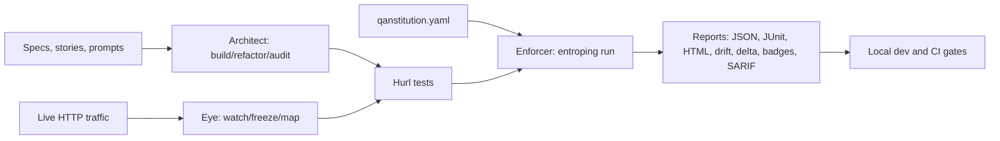
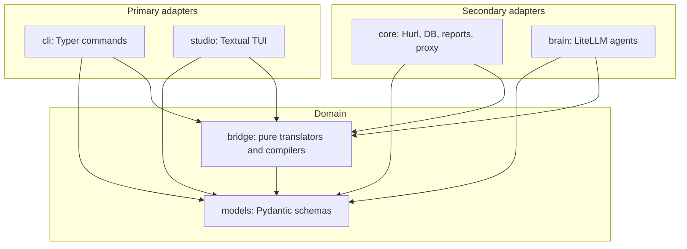

# Entroping

**Code at the speed of AI. Don't crash at the speed of AI.**

[](https://scorecard.dev/viewer/?uri=github.com/sakibshuvo/Entroping)

Entroping is a local-first runtime governance layer for AI-assisted backend
development. Let agents generate code, propose tests, and refactor APIs; keep
the merge decision deterministic with Hurl, executable policy gates, and
CI-ready reports.

The core rule is simple: **AI can suggest. Runtime truth decides.**

Project philosophy: **The QAnstitution is Law. Traffic is Truth. Hurl is the Enforcer.**

**Start here:** [Public Docs](https://sakibshuvo.github.io/Entroping/) ·
[Two-Minute Demo](#try-it-in-two-minutes) · [Roadmap](ROADMAP.md) ·
[Troubleshooting](#first-hour-troubleshooting) · [Project Context](#project-context)

## Why Entroping

AI can now ship backend changes faster than humans can fully review them. The
hard failures rarely show up in static review: wrong status codes, broken auth,
schema drift, undocumented dependencies, slow endpoints, and "looks fine" code
that quietly breaks production behavior.

Entroping gives that workflow a hard guardrail:

- **QAnstitution is Law:** define security, latency, schema, and ownership rules once.
- **Traffic is Truth:** capture real HTTP behavior and freeze it into regression coverage.
- **Hurl is the Enforcer:** execute committed `.hurl` tests through a deterministic Rust binary.
- **CI stays LLM-free:** generation can use AI, but `entroping run` is reproducible.

## Use Entroping When

- **AI changed your API:** prove runtime behavior still passes committed Hurl tests before merge.
- **Your spec exists but tests do not:** generate reviewable Hurl coverage from OpenAPI.
- **Legacy behavior is undocumented:** watch real traffic, redact it, and freeze regression tests or mocks.
- **Rules should apply everywhere:** enforce status, latency, headers, and policy-pack gates through `qanstitution.yaml`.
- **PRs need evidence:** emit JSON, JUnit, HTML, drift, delta, traceability, and GitHub annotations.

## Try It In Two Minutes

Clone the repo, install `uv` and Hurl, and run the checkout demo:

```bash
git clone https://github.com/sakibshuvo/Entroping.git
cd Entroping
brew install uv hurl # macOS; use your package manager elsewhere
scripts/demo.sh
```

Expected proof:

```text
Hurl run: 4 passed, 0 failed
Wrote report: reports/run-latest.json
Wrote report: reports/junit.xml
Wrote report: reports/run-latest.html
```

`scripts/demo.sh` is the friendly checkout entrypoint. It delegates to the
same deterministic `scripts/live_demo_smoke.sh` release gate used by CI and
launch-asset rebuilds.

Animated previews show the happy path and the failure path:


[examples/ai-regression-demo](examples/ai-regression-demo/README.md) is the failure-path
fixture used by launch checks.

For public launch previews, use the
[Two-Minute Demo Assets](docs/assets/launch/README.md):

- [Terminal demo screenshot](docs/assets/launch/terminal-demo-screenshot.png)
  from the same live smoke path used by `scripts/demo.sh`.
- [HTML report screenshot](docs/assets/launch/html-report-screenshot.png)
  captured from `reports/run-latest.html`.
- [Dependency map screenshot](docs/assets/launch/dependency-map-screenshot.png)
  generated from redacted traffic state.

## Security Policy Pack Wedge

The [OWASP API Top 10 starter policy pack](examples/policy-packs/owasp-api-top-10/README.md)
is the quickest way to see Entroping as runtime governance instead of generic
test generation. Vendor the pack, import its `qanstitution.yaml`, and use Hurl
evidence to catch missing auth, missing request ID headers, server-error
regressions, and latency budget breaches before merge.

This is an OWASP API Security Top 10-inspired starter pack. It is not official
OWASP endorsement, not complete compliance, and not certification evidence.

## What You Get

Entroping is not another AI chat wrapper. It is an execution boundary for API
quality:

- Turn OpenAPI specs into reviewable Hurl regression tests, including
  supported auth-negative coverage from declared security schemes.
- Inject global QAnstitution gates into every run without mutating source tests.
- Capture and redact live traffic, then freeze flows or dependency mocks.
- Emit JSON, JUnit, HTML, drift, delta, badge, SARIF, bug, retry/flake, and traceability evidence for local review and CI.
- Bundle Builder, Breaker, and Auditor run evidence from sanitized local manifests before human review.



## Current Alpha

This repository is the active alpha implementation for Entroping.

Public roadmap: [ROADMAP.md](ROADMAP.md) and
[GitHub Project board](https://github.com/users/sakibshuvo/projects/1).

Built today:

- Locked v4.1 CLI surface for `init`, `doctor`, `config`, `architect`, `watch`,
  `freeze`, `map`, `run`, `studio`, and `report`.
- QAnstitution loading with safe local imports, typed condition validation,
  duplicate gate checks, and final imported gate protection.
- Hurl discovery, metadata parsing, tag filters, gate matching, temporary
  execution-copy injection, subprocess timeouts, output redaction, and bounded
  parallel execution.
- JSON, JUnit, HTML, drift, delta, Shields-compatible badge, SARIF, bug, and traceability reporting.
- Deterministic OpenAPI-to-Hurl generation plus Architect prompt build,
  merge, refactor, audit, persona loading, LiteLLM routing, structured output
  parsing, and pre-write Hurl validation.
- Eye capture/freeze/map foundation with mitmproxy capture, SQLModel-backed
  SQLite state, redaction before persistence, generated Hurl flows, optional
  dependency export artifacts, and Mermaid/DOT/Markdown/PNG dependency maps.
- Local and CI quality gates through `uv`, `ruff`, `mypy`, `pytest`, coverage,
  package verification, security checks, optional-extras smoke, live demo smoke,
  and quality audit.

Still alpha:

- Dependency-call drift is route-level only: host, method, and templated path,
  with no raw traffic values.
- Architect validation guidance is improved, but the broader UX is intentionally narrow.
- The optional local inspector is read-only, including applied-gate drilldowns
  over existing reports; future mutation workflows must follow
  [STUDIO_MUTATION_WORKFLOW_DESIGN.md](docs/technical/STUDIO_MUTATION_WORKFLOW_DESIGN.md).

## Install

The alpha is source-distributed first. PyPI, Homebrew, and standalone binaries
are later distribution tracks.

Install from the latest GitHub branch:

```bash
uv tool install git+https://github.com/sakibshuvo/Entroping.git
```

Install from the alpha tag:

```bash
uv tool install git+https://github.com/sakibshuvo/Entroping.git@v0.1.1-alpha
```

For local development in a checkout:

```bash
uv tool install -e .
```

Optional shell completion comes from Typer's existing global options:

```bash
entroping --install-completion
entroping --show-completion
```

This is a Typer global option, not an Entroping subcommand, so it does not
change the locked CLI namespace.

Requirements:

- Python 3.12 or 3.13
- [`uv`](https://docs.astral.sh/uv/)
- [`hurl`](https://hurl.dev/) 4.3.0 or newer for deterministic execution and
  the live demo (`brew install hurl` on macOS, or use the
  [official Hurl install guide](https://hurl.dev/docs/installation.html))
- Optional extras: `mitmproxy` for `watch`, LiteLLM providers for prompt-backed Architect work, Graphviz for PNG maps
  ([AI_PROVIDER_SETUP.md](docs/user/AI_PROVIDER_SETUP.md) covers LiteLLM,
  local Qwen/oMLX, and no-provider CI)

CI proves Python 3.12 and 3.13 for the security regression suite and optional
extras smoke. Python 3.12 remains the syntax and mypy floor; Entroping is not
claimed for Python 3.14 until CI evidence is added.

## First-Hour Troubleshooting

Most first-run failures are setup mismatches, not Entroping runtime failures.

| Symptom | Check |
| --- | --- |
| `uv` is missing | Install `uv`, then retry `uv tool install ...` or `scripts/demo.sh`. |
| Python is rejected | Use Python 3.12 or 3.13; Python 3.14 is not claimed until CI evidence exists. |
| Hurl is missing | Install Hurl 4.3.0 or newer, then run `entroping doctor`. |
| Architect validation fails | Install `hurlfmt`; generated Hurl validation reports it separately from Hurl execution. |

The full setup path is in [USER_GUIDE.md](docs/user/USER_GUIDE.md). Maintainer
install-smoke evidence is linked from Project Context below.

## Use The CLI

Create a minimal local project:

```bash
entroping init --minimal
entroping doctor
```

To also install the reviewed GitHub Actions starter workflow, run
`entroping init --github-actions` or
`entroping init --minimal --github-actions`. Entroping writes
`.github/workflows/entroping.yml` and refuses to overwrite an existing
workflow.

For automation, use `entroping doctor --output json` to get versioned setup
health without scraping human output. `doctor` also runs `hurl --version` through
the local subprocess boundary and reports whether the installed Hurl is missing,
compatible, unsupported, or unparsable. Entroping supports Hurl 4.3.0 or newer;
the included CI starter pins Hurl 8.0.1 for repeatable examples.
Before wiring a PR gate, run `entroping doctor --ci` or
`entroping doctor --ci --output json` to validate Hurl availability, safe local
artifact paths, suite manifests, required Hurl variables, and the provider-free
`run --ci` boundary.

The starter policy is intentionally small: status, latency, and request-ID
header gates. See [QANSTITUTION_FIRST_HOUR.md](docs/user/QANSTITUTION_FIRST_HOUR.md)
before jumping into the full reference.

Editor autocomplete is already wired for `qanstitution.yaml`: Entroping ships
[docs/technical/qanstitution.schema.json](docs/technical/qanstitution.schema.json),
and [QANSTITUTION_REFERENCE.md](docs/technical/QANSTITUTION_REFERENCE.md) shows
the VS Code / YAML language server mapping. The schema catches authoring shape
mistakes early; `entroping doctor` remains the authoritative runtime validation.

Generate tests from OpenAPI:

```bash
entroping architect build --new --tag smoke
```

During feature work, generate only operations changed from a Git base ref:

```bash
entroping architect build --new --changed-from origin/main --tag smoke
```

Run deterministic tests and reports:

```bash
entroping run --env local --tag smoke --report json --report junit --report html
```

Capture and freeze legacy behavior:

```bash
entroping watch --target http://localhost:3000
entroping freeze --name checkout_flow --golden --dry-run
entroping freeze --name checkout_flow --golden
entroping map --export mermaid --include-host api.example.test
```

Route AI generation without putting the LLM in CI:

```bash
entroping config set --agent builder --model openai/gpt-4.1-mini
entroping architect build --prompt "Generate checkout smoke coverage" --tag ai
entroping config set --agent breaker --model deepseek/deepseek-r1
entroping architect build --agent breaker --prompt "Generate hostile auth and IDOR tests" --tag security
```

## Develop Locally

Install dependencies:

```bash
uv sync --dev
```

Run the normal regression gate:

```bash
scripts/regression.sh
```

Run security-sensitive gates:

```bash
scripts/feature_gate.sh --security
scripts/regression.sh --security
```

CI enforces `scripts/regression.sh --security` for pull requests and pushes to
`main`. CI enforces `scripts/audit_quality.sh` as a separate quality-audit job,
runs `install-smoke` across Linux, macOS, and Windows, and runs
`optional-extras-smoke` with all optional dependencies installed so
AI-provider, proxy, and local-inspector extras boot without provider credentials
or live traffic capture. The quality-audit job uploads generated reports as
workflow artifacts.

Local-only before release:

```bash
scripts/package_check.sh
uv run python scripts/performance_smoke.py
scripts/release_check.sh --dry-run --require-live-demo
scripts/release_check.sh --require-live-demo
```

Release-owner checklists, package-index publishing, install-channel sequencing,
and agent handoff are backstage maintainer context linked below.

## Project Context
Public Docs are the adoption path. Maintainer and agent context is backstage and
not required for first use.

Obsidian is project memory, not the backlog.
`docs/meta/DOCS_GOVERNANCE.md` decides which docs must change.

- Public first-hour path:
  - [Public Docs](https://sakibshuvo.github.io/Entroping/)
  - [QAnstitution First Hour](docs/user/QANSTITUTION_FIRST_HOUR.md)
  - [USER_GUIDE.md](docs/user/USER_GUIDE.md)
  - [Use Cases](docs/user/USE_CASES.md)

- Work visibility and execution context:
  - GitHub Issues track work; [ROADMAP.md](ROADMAP.md) and
    [PROJECT_PROGRESS.md](docs/meta/PROJECT_PROGRESS.md) track sequence and
    daily status.
  - `scripts/start_issue.sh` and `scripts/context_pack.sh` support issue-scoped
    handoff sessions. In implementation workflows, run
    `scripts/context_pack.sh --mode implementation`.

- Maintainer context (not first-hour docs):
- Obsidian vault index: [Vault Index](docs/meta/VAULT_INDEX.md)
  - CI provider recipes: [CI_PROVIDER_RECIPES.md](docs/user/CI_PROVIDER_RECIPES.md)
  - GitHub Actions starter: [GITHUB_ACTIONS_STARTER.md](docs/user/GITHUB_ACTIONS_STARTER.md)
  - Distribution recommendation: [DISTRIBUTION_RECOMMENDATION.md](docs/meta/DISTRIBUTION_RECOMMENDATION.md)
  - Policy pack layout: [POLICY_PACK_LAYOUT.md](docs/technical/POLICY_PACK_LAYOUT.md)
  - Documentation governance: [DOCS_GOVERNANCE.md](docs/meta/DOCS_GOVERNANCE.md)
  - Surface classification: [SURFACE_SCOPE.md](docs/technical/SURFACE_SCOPE.md)
  - Decision registry: [DECISION_REGISTRY.yaml](docs/meta/DECISION_REGISTRY.yaml)
  - Release evidence: [PYPI_RELEASE_RUNBOOK.md](docs/meta/PYPI_RELEASE_RUNBOOK.md),
    [INSTALL_SMOKE_MATRIX.md](docs/meta/INSTALL_SMOKE_MATRIX.md),
    [RELEASE_CHECKLIST.md](docs/meta/RELEASE_CHECKLIST.md), and
    [release-evidence.json](docs/meta/release-evidence.json).

Launch copy remains REST/OpenAPI + QAnstitution + Hurl + CI reports; optional
surfaces are clearly marked and documented in [SURFACE_SCOPE.md](docs/technical/SURFACE_SCOPE.md).

advanced examples remain documented for maintainers in the vault index, including
[examples/support-api](examples/support-api/README.md).

The public docs site is generated by `mkdocs.yml`; CI runs a strict docs build
on pull requests, and GitHub Pages publishes `main` to
[sakibshuvo.github.io/Entroping](https://sakibshuvo.github.io/Entroping/).

## Locked Alpha CLI Surface

The README shows the primary workflows. The full locked command reference lives
in [COMMAND_CHEAT_SHEET.md](docs/technical/COMMAND_CHEAT_SHEET.md), and
compatibility details live in
[CLI_COMPATIBILITY_AUDIT.md](docs/technical/CLI_COMPATIBILITY_AUDIT.md).

| Workflow | Primary command | Purpose |
| --- | --- | --- |
| Start | `entroping init` | Create the local QAnstitution and project layout. |
| Diagnose | `entroping doctor` | Validate Python, Hurl, hurlfmt, policy, and CI readiness. |
| Generate | `entroping architect build` | Generate reviewable Hurl tests from OpenAPI or bounded prompts. |
| Observe | `entroping watch` / `entroping freeze` / `entroping map` | Capture, redact, freeze, and map real traffic. |
| Enforce | `entroping run` | Inject QAnstitution gates and execute committed Hurl tests. |
| Report | `entroping report` | Emit CI and review artifacts such as JSON, JUnit, HTML, SARIF, and traceability. |

`architect audit --focus logic` is deterministic: it compares the configured
OpenAPI document with committed Hurl metadata, reports uncovered operations,
and includes an operation-to-test matrix with stale `operation_id` references.
When redacted Eye traffic exists, it also flags captured routes that are not in
the OpenAPI contract without printing raw query strings, headers, cookies,
bodies, or captured values. Add `--changed-from <ref>` to compare the configured
local OpenAPI spec with the same file at a Git base ref and report deterministic
operation, status, required-input, and response-shape changes without generating
or deleting tests.

`entroping studio --env local` is a read-only traffic session browser as well
as a local run/status view. The Traffic tab reads redacted SQLModel-backed state
from `.entroping/state.db`, shows inferred target/dependency grouping, route
counts, latency summaries, and safe redaction categories and counts. It does not
start `watch`, run Hurl, write config, or render raw URLs with query values,
headers, bodies, cookies, tokens, or secrets.

Deprecated names such as `gen`, `fix`, `scan`, `chaos`, and `report --type`
are intentionally not primary commands.

## Architecture

Entroping follows a Ports and Adapters design:



Dependency rule: domain modules do not import adapters.

## Repository Map

```text
src/entroping/         Python package implementation
tests/                 Fast regression and boundary tests
docs/product/          Product spec, MVP plan, and marketing note
docs/technical/        TDS, QAnstitution, command contract, Codex prompt
docs/user/             User guide, flows, and use cases
docs/evolution/        Timeline, requirements analysis, and creator intent
docs/architecture/     Architecture, diagrams, and development guide
docs/meta/             Obsidian onboarding, progress, and project operations
docs/technical/SURFACE_SCOPE.md  Feature-surface classification for launch scope
examples/              Minimal fixtures for onboarding and tests
decisions/             ADRs for durable product decisions
sources/               Source-material map
.context/              Maintainer/agent handoff context, hidden from public docs
AGENTS.md              Project-local Codex implementation rules
```

## Contributing And Community

- [GOOD_FIRST_ISSUE_WALKTHROUGH.md](docs/meta/GOOD_FIRST_ISSUE_WALKTHROUGH.md) gives new contributors a deterministic path from issue selection to local gates.
- [CONTRIBUTING.md](CONTRIBUTING.md) explains the local development and PR rules.
- [SECURITY.md](SECURITY.md) explains private vulnerability reporting and security gates.
- [CODE_OF_CONDUCT.md](CODE_OF_CONDUCT.md) sets the project conduct baseline.

The open-source growth and monetization strategy lives in
[GROWTH_AND_MONETIZATION.md](docs/product/GROWTH_AND_MONETIZATION.md), with
maintainer guardrails in
[OPEN_CORE_BOUNDARIES.md](docs/product/OPEN_CORE_BOUNDARIES.md).

Public trust signals:

- `scripts/community_profile_audit.sh` verifies local community-health files.
- `.github/workflows/scorecard.yml` runs OpenSSF Scorecard weekly or manually,
  publishes results for the README badge, and is not a pull-request gate.

## Security and Quality Rules

- Do not log or commit secrets.
- Keep `.entroping/`, reports, local env files, and generated Graphify output out of Git.
- Use Hurl as the execution boundary; do not replace API execution with Python HTTP clients.
- Keep `entroping run` deterministic and LLM-free.
- Treat generated tests as code that must be reviewed.
- Audit optional extras before release:

```bash
uv run --all-extras --with pip-audit pip-audit --progress-spinner off
```

## License

Entroping Core is licensed under Apache-2.0. See [LICENSE](LICENSE).

The public core is intended to stay adoption-friendly and genuinely open source.
Future hosted, team, enterprise, model, policy-pack, or support offerings may be
distributed separately under commercial terms as defined by
[OPEN_CORE_BOUNDARIES.md](docs/product/OPEN_CORE_BOUNDARIES.md).
