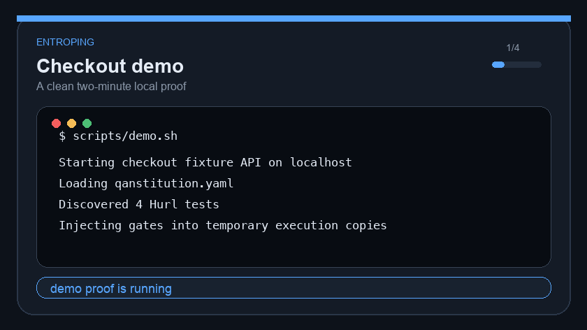
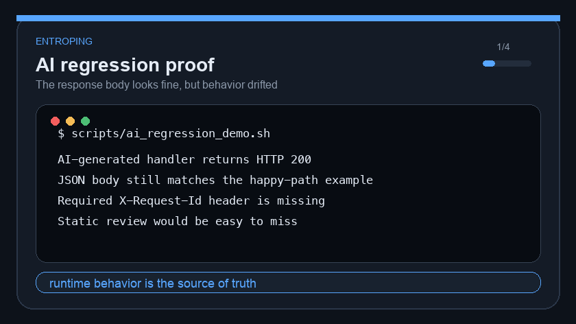

# Entroping

**Code at the speed of AI. Don't crash at the speed of AI.**

[](https://scorecard.dev/viewer/?uri=github.com/sakibshuvo/Entroping)

Entroping is a local-first runtime governance layer for AI-assisted backend development. Let agents generate code, propose tests, and refactor APIs; keep the merge decision deterministic with Hurl, executable policy gates, and CI-ready reports.

The core rule is simple: **AI can suggest. Runtime truth decides.**

Project philosophy: **The QAnstitution is Law. Traffic is Truth. Hurl is the Enforcer.**

**Start here:** [Public Docs](https://sakibshuvo.github.io/Entroping/) · [Two-Minute Demo](#try-it-in-two-minutes) · [Roadmap](ROADMAP.md) · [Changelog](CHANGELOG.md) · [Troubleshooting](#first-hour-troubleshooting) · [Project Context](#project-context)

## Why Entroping

AI can ship backend changes faster than humans can fully review them. The hard failures rarely show up in static review: wrong status codes, broken auth, schema drift, undocumented dependencies, slow endpoints, and "looks fine" code that quietly breaks production behavior.

- **QAnstitution is Law:** define security, latency, schema, and ownership rules once.
- **Traffic is Truth:** capture real HTTP behavior and freeze it into regression coverage.
- **Hurl is the Enforcer:** execute committed `.hurl` tests through a deterministic Rust binary.
- **CI stays LLM-free:** generation can use AI, but `entroping run` is reproducible.

## Use Entroping When

- **AI changed your API:** prove runtime behavior still passes committed Hurl tests before merge.
- **Your spec exists but tests do not:** generate reviewable Hurl coverage from OpenAPI.
- **Legacy behavior is undocumented:** watch real traffic, redact it, and freeze regression tests.
- **Rules should apply everywhere:** enforce status, latency, headers, and policy-pack gates through `qanstitution.yaml`.
- **PRs need evidence:** emit JSON, JUnit, HTML, drift, delta, traceability, and GitHub annotations.

## Try It In Two Minutes

Clone the repo, install `uv` and Hurl, and run the checkout demo:

```bash
git clone https://github.com/sakibshuvo/Entroping.git
cd Entroping
brew install uv hurl # macOS; use your package manager elsewhere
scripts/demo.sh
```

Expected proof: Hurl passes and writes JSON, JUnit, and HTML reports. `scripts/demo.sh` delegates to the same deterministic `scripts/live_demo_smoke.sh` release gate used by CI.





[examples/ai-regression-demo](examples/ai-regression-demo/README.md) is the failure-path fixture.
For launch screenshots, including `docs/assets/launch/terminal-demo-screenshot.png`, `docs/assets/launch/html-report-screenshot.png`, and `docs/assets/launch/dependency-map-screenshot.png`, plus GIF rebuilds, see the [Two-Minute Demo Assets](docs/assets/launch/README.md).

## Security Policy Pack Wedge

The [OWASP API Top 10 starter policy pack](examples/policy-packs/owasp-api-top-10/README.md) shows Entroping as runtime governance instead of generic test generation. It catches missing auth, missing request ID headers, server-error regressions, and latency budget breaches before merge.

This is an OWASP API Security Top 10-inspired starter pack. It is not official OWASP endorsement, not complete compliance, and not certification evidence.

## What You Get

- OpenAPI-to-Hurl generation, including supported auth-negative coverage.
- QAnstitution gate injection into temporary execution copies, never source tests.
- Redacted traffic capture, freeze, dependency mapping, and approval manifests.
- JSON, JUnit, HTML, drift, delta, badge, SARIF, bug, retry, and traceability evidence.
- Sanitized Builder, Breaker, and Auditor evidence bundles for human review.

## Current Alpha

This repository is the active alpha implementation for Entroping.

Version note: v4.1 is the product/spec/CLI contract generation, not the Python package release version. Package releases use alpha Git tags and PEP 440 package metadata tracked from `pyproject.toml`.

Public roadmap: [ROADMAP.md](ROADMAP.md) and [GitHub Project board](https://github.com/users/sakibshuvo/projects/1).

Built today: locked v4.1 CLI surface, QAnstitution validation, Hurl discovery and execution, deterministic OpenAPI generation, prompt-backed Architect workflows through LiteLLM, Eye capture/freeze/map foundations, report artifacts, and local plus CI gates.

Still alpha: package-index proof, compatibility graduation, and real downstream feedback remain open stable-core blockers. Dependency-call drift is route-level only, and Architect UX remains intentionally narrow.

## Install

The alpha is source-distributed first. PyPI, Homebrew, and standalone binaries are later distribution tracks.

```bash
uv tool install git+https://github.com/sakibshuvo/Entroping.git
uv tool install git+https://github.com/sakibshuvo/Entroping.git@v0.1.1-alpha
uv tool install -e . # local checkout
```

Optional shell completion comes from Typer's existing global options:

```bash
entroping --install-completion
entroping --show-completion
```

This is a Typer global option, not an Entroping subcommand.

Requirements: Python 3.12 or 3.13, [`uv`](https://docs.astral.sh/uv/), and [`hurl`](https://hurl.dev/) 4.3.0 or newer. Optional setup is covered in [AI_PROVIDER_SETUP.md](docs/user/AI_PROVIDER_SETUP.md).

## First-Hour Troubleshooting

| Symptom | Check |
| --- | --- |
| `uv` is missing | Install `uv`, then retry `uv tool install ...` or `scripts/demo.sh`. |
| Python is rejected | Use Python 3.12 or 3.13; Python 3.14 is not claimed until CI evidence exists. |
| Hurl is missing | Install Hurl 4.3.0 or newer, then run `entroping doctor`. |
| Architect validation fails | Install `hurlfmt`; generated Hurl validation reports it separately from Hurl execution. |

The full setup path is in [USER_GUIDE.md](docs/user/USER_GUIDE.md).

## Use The CLI

```bash
entroping init --minimal
entroping doctor
entroping architect build --new --tag smoke
entroping run --env local --tag smoke --report json --report junit --report html
```

For first policy authoring, use [QAnstitution First Hour](docs/user/QANSTITUTION_FIRST_HOUR.md). Editor schema mapping for `qanstitution.yaml` uses [docs/technical/qanstitution.schema.json](docs/technical/qanstitution.schema.json) and is documented in [QANSTITUTION_REFERENCE.md](docs/technical/QANSTITUTION_REFERENCE.md). `entroping doctor` remains the authoritative runtime validation.

## Develop Locally

```bash
uv sync --dev
scripts/regression.sh
scripts/feature_gate.sh --security
scripts/regression.sh --security
```

CI enforces `scripts/regression.sh --security` for pull requests and pushes to `main`. CI enforces `scripts/audit_quality.sh` as a separate quality-audit job, runs cross-platform install smokes, optional-extras smoke, and the live demo.

Local-only before release:

```bash
scripts/package_check.sh
uv run python scripts/performance_smoke.py
scripts/release_check.sh --dry-run --require-live-demo
scripts/release_check.sh --require-live-demo
```

## Project Context

Public Docs are the adoption path. Maintainer and agent context is backstage and not required for first use.

Obsidian is project memory, not the backlog.
`docs/meta/DOCS_GOVERNANCE.md` decides which docs must change; [DOCS_GOVERNANCE.md](docs/meta/DOCS_GOVERNANCE.md) is the canonical update gate.

- Public first-hour path: [Public Docs](https://sakibshuvo.github.io/Entroping/), [QAnstitution First Hour](docs/user/QANSTITUTION_FIRST_HOUR.md), [USER_GUIDE.md](docs/user/USER_GUIDE.md), [Use Cases](docs/user/USE_CASES.md).
- Work visibility: GitHub Issues track work; [ROADMAP.md](ROADMAP.md), [PROJECT_PROGRESS.md](docs/meta/PROJECT_PROGRESS.md), and [GitHub Project board](https://github.com/users/sakibshuvo/projects/1) track sequence and status.
- Handoff context: `scripts/start_issue.sh`, `scripts/context_pack.sh --mode implementation`, and [Vault Index](docs/meta/VAULT_INDEX.md).
- CI and release context: [CI_PROVIDER_RECIPES.md](docs/user/CI_PROVIDER_RECIPES.md), [GITHUB_ACTIONS_STARTER.md](docs/user/GITHUB_ACTIONS_STARTER.md), [INSTALL_SMOKE_MATRIX.md](docs/meta/INSTALL_SMOKE_MATRIX.md), [DISTRIBUTION_RECOMMENDATION.md](docs/meta/DISTRIBUTION_RECOMMENDATION.md), [PYPI_RELEASE_RUNBOOK.md](docs/meta/PYPI_RELEASE_RUNBOOK.md), [RELEASE_CHECKLIST.md](docs/meta/RELEASE_CHECKLIST.md), and `mkdocs.yml`.
- Product boundaries: REST/OpenAPI + QAnstitution + Hurl + CI reports, [SURFACE_SCOPE.md](docs/technical/SURFACE_SCOPE.md), [POLICY_PACK_LAYOUT.md](docs/technical/POLICY_PACK_LAYOUT.md), and [DECISION_REGISTRY.yaml](docs/meta/DECISION_REGISTRY.yaml).
- Local inspector boundary: optional local inspector is read-only; applied-gate drilldowns link latest-run report rule IDs to QAnstitution gates, and mutation design remains deferred in [STUDIO_MUTATION_WORKFLOW_DESIGN.md](docs/technical/STUDIO_MUTATION_WORKFLOW_DESIGN.md).
- Launch scope: optional advanced examples remain documented for maintainers in the vault index, including [examples/support-api](examples/support-api/README.md).

## Locked Alpha CLI Surface

The README shows primary workflows. Full command details live in [COMMAND_CHEAT_SHEET.md](docs/technical/COMMAND_CHEAT_SHEET.md), and compatibility details live in [CLI_COMPATIBILITY_AUDIT.md](docs/technical/CLI_COMPATIBILITY_AUDIT.md).

| Workflow | Primary command | Purpose |
| --- | --- | --- |
| Start | `entroping init` | Create local QAnstitution and project layout. |
| Diagnose | `entroping doctor` | Validate Python, Hurl, hurlfmt, policy, and CI readiness. |
| Generate | `entroping architect build` | Generate reviewable Hurl tests from OpenAPI or bounded prompts. |
| Observe | `entroping watch` / `entroping freeze` / `entroping map` | Capture, redact, freeze, and map real traffic. |
| Enforce | `entroping run` | Inject QAnstitution gates and execute committed Hurl tests. |
| Report | `entroping report` | Emit CI and review artifacts such as JSON, JUnit, HTML, SARIF, and traceability. |

Deprecated names such as `gen`, `fix`, `scan`, `chaos`, and `report --type` are intentionally not primary commands.

## Architecture

Entroping follows a Ports and Adapters design. Domain modules in `models` and `bridge` do not import adapters; Python orchestrates, Hurl enforces, and LiteLLM-backed Architect flows never run inside `entroping run`. See [ARCHITECTURE.md](docs/architecture/ARCHITECTURE.md) and [DIAGRAMS.md](docs/architecture/DIAGRAMS.md).

## Repository Map

`src/entroping/` contains the Python package, `tests/` contains regression and boundary tests, `docs/` contains public/user/technical/product context, `examples/` contains onboarding fixtures, `decisions/` contains ADRs, and `AGENTS.md` contains project-local Codex implementation rules.

## Contributing And Community

[GOOD_FIRST_ISSUE_WALKTHROUGH.md](docs/meta/GOOD_FIRST_ISSUE_WALKTHROUGH.md), [CONTRIBUTING.md](CONTRIBUTING.md), [SECURITY.md](SECURITY.md), [CODE_OF_CONDUCT.md](CODE_OF_CONDUCT.md), [GROWTH_AND_MONETIZATION.md](docs/product/GROWTH_AND_MONETIZATION.md), and [OPEN_CORE_BOUNDARIES.md](docs/product/OPEN_CORE_BOUNDARIES.md).

Public trust signals: `scripts/community_profile_audit.sh` verifies local community-health files, and `.github/workflows/scorecard.yml` runs OpenSSF Scorecard weekly or manually for the README badge.

## Security and Quality Rules

Do not log or commit secrets. Keep `.entroping/`, reports, local env files, and generated Graphify output out of Git. Use Hurl as the execution boundary; do not replace API execution with Python HTTP clients. Keep `entroping run` deterministic and LLM-free. Treat generated tests as code that must be reviewed. Audit optional extras before release: `uv run --all-extras --with pip-audit pip-audit --progress-spinner off`.

## License

Entroping Core is licensed under Apache-2.0. See [LICENSE](LICENSE). The public core is intended to stay adoption-friendly and genuinely open source. Future hosted, team, enterprise, model, policy-pack, or support offerings may be distributed separately under commercial terms as defined by [OPEN_CORE_BOUNDARIES.md](docs/product/OPEN_CORE_BOUNDARIES.md).
