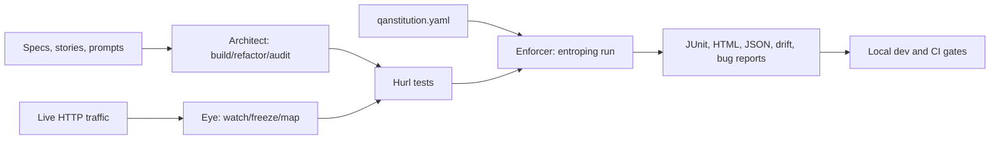
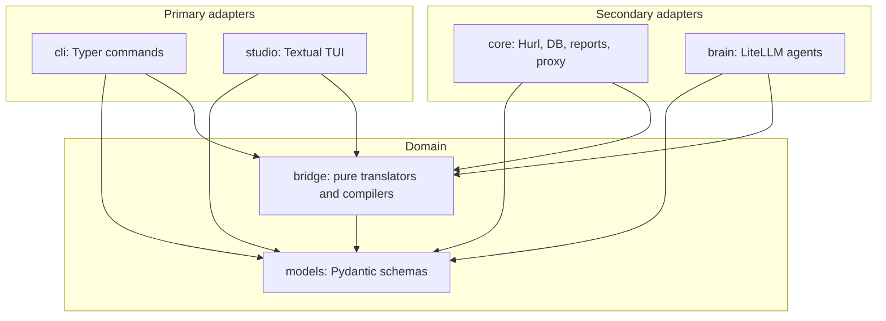

# Entroping

**AI-native quality governance for API and backend systems.**

Entroping is a local-first integrity layer for high-velocity AI-assisted development. It lets AI help generate and maintain API tests, but it keeps final enforcement deterministic: committed Hurl files, executable governance rules, and reproducible CI reports.

> AI writes code fast. Entroping makes runtime truth slow enough to trust.

## What It Is

Entroping turns product intent, API specifications, live traffic, and policy rules into a governance loop:



The core rule is simple: **LLMs may propose tests, but Hurl and the QAnstitution decide pass or fail.**

## Four Pillars

- **Architect:** AI-assisted generation, refactoring, and audit of Hurl tests.
- **Eye:** mitmproxy-powered traffic capture, golden flows, mocks, and dependency maps.
- **Enforcer:** deterministic Hurl execution with QAnstitution gate injection.
- **Lifecycle:** Git-native traceability through tags, story IDs, ADRs, reports, and CI artifacts.

## Current Status

This repository is the initial Entroping knowledge base and implementation scaffold.

Available now:

- Product, technical, user, command, and MVP specifications.
- Obsidian vault with linked evolution notes and ADRs.
- Python package scaffold with the locked v4.1 CLI surface.
- `entroping init --minimal` for a minimal local runtime skeleton and `qanstitution.yaml`.
- `entroping doctor` for local Python, Hurl availability, and QAnstitution config health checks.
- QAnstitution loading with root-bounded local imports, condition validation, duplicate gate checks, and final imported gate protection.
- CI-ready local checks through `uv`, `ruff`, `mypy`, and `pytest`.

Not built yet:

- Real Hurl execution and gate injection.
- mitmproxy traffic capture.
- LiteLLM Architect implementation.
- Studio TUI.

## Quick Start

### Read the Product

Open this repository in Obsidian and start with [00_INDEX.md](00_INDEX.md).

Important docs:

- [PRODUCT_SPEC.md](docs/product/PRODUCT_SPEC.md) - product contract.
- [TDS.md](docs/technical/TDS.md) - technical design.
- [COMMAND_CHEAT_SHEET.md](docs/technical/COMMAND_CHEAT_SHEET.md) - locked CLI namespace.
- [MVP_PLAN.md](docs/product/MVP_PLAN.md) - implementation sequence.
- [PROJECT_PROGRESS.md](docs/meta/PROJECT_PROGRESS.md) - current alpha progress dashboard.
- [ISSUE_TRACKING.md](docs/meta/ISSUE_TRACKING.md) - bug, feature, and regression tracking workflow.
- [TEST_STRATEGY.md](docs/meta/TEST_STRATEGY.md) - test pyramid and regression suite.
- [GLOSSARY.md](docs/meta/GLOSSARY.md) - plain-language terminology guide.
- [EVOLUTION_TIMELINE.md](docs/evolution/EVOLUTION_TIMELINE.md) - product history.
- [ADR-0001](decisions/ADR-0001-hurl-native-governance.md) - first architectural decision.
- [examples/checkout-api](examples/checkout-api/README.md) - tiny demo fixture.

### Set Up Development

Requirements:

- Python 3.12+
- [`uv`](https://docs.astral.sh/uv/)
- Optional for runtime later: `hurl`, `mitmproxy`, Ollama

Install dependencies:

```bash
uv sync --dev
```

Run checks:

```bash
scripts/regression.sh
```

For security-sensitive or dependency work:

```bash
scripts/feature_gate.sh --security
scripts/regression.sh --security
```

Try the scaffolded CLI:

```bash
uv run entroping --help
repo_dir="$PWD"
tmpdir="$(mktemp -d)"
cd "$tmpdir"
uv run --project "$repo_dir" entroping init --minimal
uv run --project "$repo_dir" entroping doctor
```

## Planned CLI Surface

```text
entroping init [--minimal]
entroping doctor
entroping config list
entroping config set --agent <builder|auditor|breaker> --model <model-id>

entroping architect build [--new] [--prompt <text>] [--strategy merge] [--tag <tag>]
entroping architect refactor --target <glob> --prompt <text>
entroping architect audit [--focus <logic|security|perf>] [--output <json|md>]

entroping watch [--port <port>] [--target <url>]
entroping freeze --name <flow> [--golden] [--mock <service>]
entroping map [--export <mermaid|dot|md|png>]

entroping studio [--env <name>]
entroping run [--env <name>] [--tag <tag>] [--ci] [--parallel] [--report <html|junit|json|drift> ...] [--drift-check]
entroping report bug
```

Deprecated names such as `gen`, `fix`, `scan`, `chaos`, and `report --type` are intentionally not primary commands.

## Architecture

Entroping follows a Ports and Adapters design:



Dependency rule: domain modules do not import adapters.

## Repository Map

```text
src/entroping/         Python implementation scaffold
tests/                 Fast scaffold tests
docs/product/          Product spec, MVP plan, and marketing note
docs/technical/        TDS, QAnstitution, command contract, Codex prompt
docs/user/             User guide, flows, and use cases
docs/evolution/        Timeline, requirements analysis, and creator intent
docs/architecture/     Architecture, diagrams, and development guide
docs/meta/             Obsidian onboarding notes
examples/              Minimal fixtures for onboarding and future tests
decisions/             ADRs for durable product decisions
sources/               Source-material map
.context/              Working context, changelog, lessons learned
AGENTS.md              Project-local Codex implementation rules
.obsidian/             Minimal vault configuration
```

## Security and Quality Rules

- Do not log or commit secrets.
- Keep `.entroping/`, reports, local env files, and generated Graphify output out of Git.
- Use Hurl as the execution boundary; do not replace API execution with Python HTTP clients.
- Keep `entroping run` deterministic and LLM-free.
- Treat generated tests as code that must be reviewed.
- Audit optional extras before release:

```bash
uv run --all-extras --with pip-audit pip-audit --progress-spinner off
```

## License

No license has been selected yet. Treat the project as private/proprietary until a license decision is made.
