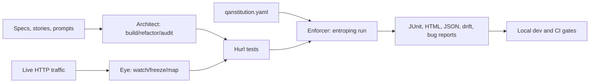
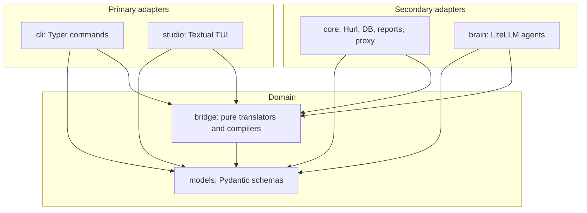

# Entroping

**AI-native quality governance for API and backend systems.**

Entroping is a local-first integrity layer for high-velocity AI-assisted development. It lets AI help generate and maintain API tests, but it keeps final enforcement deterministic: committed Hurl files, executable governance rules, and reproducible CI reports.

> AI writes code fast. Entroping makes runtime truth slow enough to trust.

## What It Is

Entroping turns product intent, API specifications, live traffic, and policy rules into a governance loop:



The core rule is simple: **LLMs may propose tests, but Hurl and the QAnstitution decide pass or fail.**

## Four Pillars

- **Architect:** AI-assisted generation, refactoring, and audit of Hurl tests.
- **Eye:** mitmproxy-powered traffic capture, golden flows, mocks, and dependency maps.
- **Enforcer:** deterministic Hurl execution with QAnstitution gate injection.
- **Lifecycle:** Git-native traceability through tags, story IDs, ADRs, reports, and CI artifacts.

## Current Status

This repository is the initial Entroping knowledge base and implementation scaffold.

Available now:

- Product, technical, user, command, and MVP specifications.
- Obsidian vault with linked evolution notes and ADRs.
- Python package scaffold with the locked v4.1 CLI surface.
- `entroping init --minimal` for a minimal local runtime skeleton and `qanstitution.yaml`.
- `entroping doctor` for local Python, Hurl availability, and QAnstitution config health checks.
- `entroping config list` and `entroping config set` for deterministic, non-secret agent model routing plus missing persona-template creation.
- QAnstitution loading with root-bounded local imports, condition validation, duplicate gate checks, and final imported gate protection.
- Hurl discovery, `# entroping:` metadata parsing, generated-state ignores, and tag-filter validation.
- QAnstitution gate matching, temporary execution-copy injection, and deterministic Hurl subprocess execution through `entroping run`, including bounded `--parallel` execution.
- Runner safety controls for timeouts, bounded output, redaction, non-zero exits, and temporary run-state cleanup.
- Redacted JSON and JUnit reports through `entroping run --report json --report junit`.
- Escaped HTML run reports through `entroping run --report html`.
- Deterministic drift JSON reports through `entroping run --drift-check --report drift`.
- `entroping report bug` for Markdown handoff from the latest failing run.
- LiteLLM-backed `entroping architect build --prompt` happy path with Builder persona/model loading, structured output parsing, parser-backed Hurl validation, redacted CLI output, and staged Architect-owned Hurl writes.
- LiteLLM-backed `entroping architect build --strategy merge --prompt` for existing Architect-owned Hurl files and manual managed blocks.
- LiteLLM-backed `entroping architect refactor` for selected Architect-owned Hurl files and manual Hurl files with explicit managed blocks, with safe target discovery, parser-backed validation, and manual-content preservation.
- Eye capture-safe traffic models, redaction, and bounded local SQLite state under `.entroping/state.db`.
- Capture-only `entroping watch` with lazy mitmproxy loading, target-scope filtering, pre-persistence redaction, and bounded local traffic state.
- Basic `entroping freeze --name <flow> [--golden]` from redacted traffic state into validated generated Hurl files.
- `entroping freeze --mock <service>` WireMock-compatible mappings from redacted dependency traffic.
- `entroping map --export <mermaid|dot|md|png>` host-level dependency maps from redacted traffic state, with escaped labels, route latency/failure summaries, and optional Graphviz-backed PNG output.
- Read-only `entroping studio --env <name>` status shell for latest run, reports, QAnstitution project, and traffic-state availability when the optional Studio extra is installed.
- CI-ready local checks through `uv`, `ruff`, `mypy`, and `pytest`.
- Local package artifact verification with wheel/sdist metadata checks through `scripts/package_check.sh`.

Not built yet:

- Broader structured response/header/schema drift beyond the current result and rule-ID baseline.
- Broader Architect validation UX.
- Full interactive Studio TUI beyond the current read-only status shell.

## Quick Start

### Read the Product

Open this repository in Obsidian and start with [00_INDEX.md](00_INDEX.md).

Important docs:

- [PRODUCT_SPEC.md](docs/product/PRODUCT_SPEC.md) - product contract.
- [TDS.md](docs/technical/TDS.md) - technical design.
- [FREEZE_MAP_PLAN.md](docs/technical/FREEZE_MAP_PLAN.md) - post-watch Eye implementation boundaries.
- [COMMAND_CHEAT_SHEET.md](docs/technical/COMMAND_CHEAT_SHEET.md) - locked CLI namespace.
- [MVP_PLAN.md](docs/product/MVP_PLAN.md) - implementation sequence.
- [PROJECT_PROGRESS.md](docs/meta/PROJECT_PROGRESS.md) - current alpha progress dashboard.
- [ISSUE_TRACKING.md](docs/meta/ISSUE_TRACKING.md) - bug, feature, and regression tracking workflow.
- [TEST_STRATEGY.md](docs/meta/TEST_STRATEGY.md) - test pyramid and regression suite.
- [RELEASE_CHECKLIST.md](docs/meta/RELEASE_CHECKLIST.md) - alpha release quality bar and evidence checklist.
- [GLOSSARY.md](docs/meta/GLOSSARY.md) - plain-language terminology guide.
- [EVOLUTION_TIMELINE.md](docs/evolution/EVOLUTION_TIMELINE.md) - product history.
- [ADR-0001](decisions/ADR-0001-hurl-native-governance.md) - first architectural decision.
- [examples/checkout-api](examples/checkout-api/README.md) - tiny demo fixture.

### Install The CLI

The alpha is source-distributed first. PyPI, Homebrew, and standalone binaries
are later distribution tracks.

Install from the latest GitHub branch:

```bash
uv tool install git+https://github.com/sakibshuvo/Entroping.git
```

Install from the alpha tag:

```bash
uv tool install git+https://github.com/sakibshuvo/Entroping.git@v0.1.0-alpha
```

For local development in a checkout:

```bash
uv tool install -e .
```

### Set Up Development

Requirements:

- Python 3.12+
- [`uv`](https://docs.astral.sh/uv/)
- [`hurl`](https://hurl.dev/) for the deterministic runner and demo
- Optional for later roadmap work: `mitmproxy`, Ollama

Install dependencies:

```bash
uv sync --dev
```

Run checks:

```bash
scripts/regression.sh
```

For security-sensitive or dependency work:

```bash
scripts/feature_gate.sh --security
scripts/regression.sh --security
```

For alpha release readiness:

```bash
scripts/package_check.sh
scripts/release_check.sh --dry-run --require-live-demo
scripts/release_check.sh --require-live-demo
```

If Hurl is not installed locally, `scripts/release_check.sh` still runs hygiene,
package verification, and the security regression suite, then skips the live
demo with an explicit message. The release-candidate form is documented in
[docs/meta/RELEASE_CHECKLIST.md](docs/meta/RELEASE_CHECKLIST.md).

Start an isolated issue session:

```bash
scripts/start_issue.sh <issue-number> <type>/<short-kebab-description> --dry-run
scripts/start_issue.sh <issue-number> <type>/<short-kebab-description>
```

Try the scaffolded CLI:

```bash
uv run entroping --help
repo_dir="$PWD"
tmpdir="$(mktemp -d)"
cd "$tmpdir"
uv run --project "$repo_dir" entroping init --minimal
uv run --project "$repo_dir" entroping doctor
```

If `hurl` is installed and the project has `.hurl` tests:

```bash
uv run --project "$repo_dir" entroping run --tag smoke
```

### Run the Alpha Demo

Terminal 1:

```bash
python examples/checkout-api/demo_server.py --port 18080
```

Terminal 2:

```bash
cd examples/checkout-api
uv run --project ../.. entroping doctor
uv run --project ../.. entroping run --tag smoke --report json --report junit
```

Expected result:

```text
Hurl run: 1 passed, 0 failed
Wrote latest run state: .entroping/latest-run.json
Wrote report: reports/run-latest.json
Wrote report: reports/junit.xml
```

Generate reviewable Hurl tests from the fixture OpenAPI source:

```bash
cd examples/checkout-api
uv run --project ../.. entroping architect build --new --tag smoke
cp envs/local.env.example envs/local.env
uv run --project ../.. entroping run --env local --tag smoke --report html --report json --report junit
ls tests/generated
uv run --project ../.. entroping architect audit --output md
```

Current generation is deterministic and local-file only. It reads `sources.spec` from
`qanstitution.yaml`, writes under `tests/generated/`, and does not call an LLM.
It supports common path, query, header, and cookie parameters plus schema examples,
defaults, constants, and enums for JSON request bodies. `--env local` loads
`envs/local.env` and passes variables such as `base_url` to Hurl.

Prompt-based Architect generation is available after you configure a non-secret
model route and install optional AI dependencies. `config set` creates a safe local
persona template when the configured persona file is missing. The checkout fixture
does not ship provider credentials. The command also requires `hurlfmt` so generated
Hurl can be parser-validated before files are written.

```bash
cd examples/checkout-api
uv run --project ../.. entroping config set --agent builder --model openai/gpt-4.1-mini
cd ../..
uv sync --dev --extra ai
cd examples/checkout-api
uv run --project ../.. entroping architect build --prompt "Generate checkout smoke coverage" --tag ai
```

CI also runs the same live demo path with a pinned Hurl binary:

```bash
scripts/live_demo_smoke.sh
```

## Planned CLI Surface

```text
entroping init [--minimal]
entroping doctor
entroping config list
entroping config set --agent <builder|auditor|breaker> --model <model-id>

entroping architect build [--new] [--prompt <text>] [--strategy merge] [--tag <tag>]
entroping architect refactor --target <glob> --prompt <text>
entroping architect audit [--focus logic] [--output <json|md>]

entroping watch [--port <port>] [--target <url>]
entroping freeze --name <flow> [--golden] [--mock <service>]
entroping map [--export <mermaid|dot|md|png>]

entroping studio [--env <name>]
entroping run [--env <name>] [--tag <tag>] [--ci] [--parallel] [--report <html|junit|json|drift> ...] [--drift-check]
entroping report bug
```

Deprecated names such as `gen`, `fix`, `scan`, `chaos`, and `report --type` are intentionally not primary commands.

Current implementation supports `init`, `doctor`, deterministic `architect build --new`
from local OpenAPI files with common parameters and schema examples, deterministic
non-secret `config list` / `config set`, `run --env`, deterministic `architect audit`
for OpenAPI coverage, deterministic `run`, JSON/JUnit run reports, HTML run reports,
`report bug`, and LiteLLM-backed `architect build --prompt` for parser-validated,
Builder-generated Architect-owned Hurl files, prompt-backed `architect build
--strategy merge` for existing managed regions, plus LiteLLM-backed `architect
refactor` for selected Architect-owned Hurl files and manual files that opt into
managed-block replacement.

## Architecture

Entroping follows a Ports and Adapters design:



Dependency rule: domain modules do not import adapters.

## Repository Map

```text
src/entroping/         Python implementation scaffold
tests/                 Fast scaffold tests
docs/product/          Product spec, MVP plan, and marketing note
docs/technical/        TDS, QAnstitution, command contract, Codex prompt
docs/user/             User guide, flows, and use cases
docs/evolution/        Timeline, requirements analysis, and creator intent
docs/architecture/     Architecture, diagrams, and development guide
docs/meta/             Obsidian onboarding notes
examples/              Minimal fixtures for onboarding and future tests
decisions/             ADRs for durable product decisions
sources/               Source-material map
.context/              Working context, changelog, lessons learned
AGENTS.md              Project-local Codex implementation rules
.obsidian/             Minimal vault configuration
```

## Security and Quality Rules

- Do not log or commit secrets.
- Keep `.entroping/`, reports, local env files, and generated Graphify output out of Git.
- Use Hurl as the execution boundary; do not replace API execution with Python HTTP clients.
- Keep `entroping run` deterministic and LLM-free.
- Treat generated tests as code that must be reviewed.
- Audit optional extras before release:

```bash
uv run --all-extras --with pip-audit pip-audit --progress-spinner off
```

## License

Entroping Core is licensed under Apache-2.0. See [LICENSE](LICENSE).

The public core is intended to stay adoption-friendly and genuinely open source. Future hosted, team, enterprise, model, policy-pack, or support offerings may be distributed separately under commercial terms.
