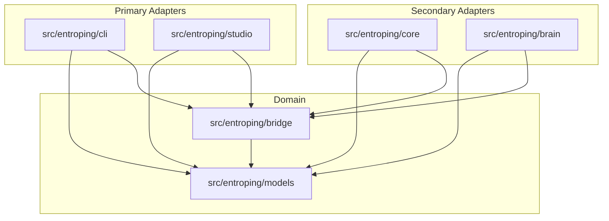
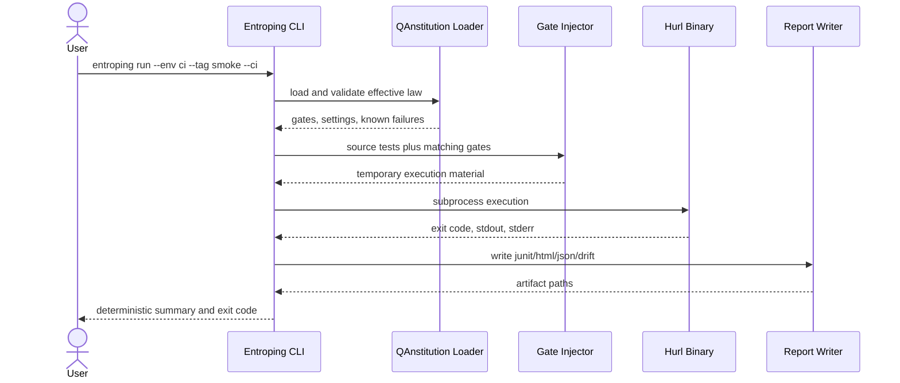
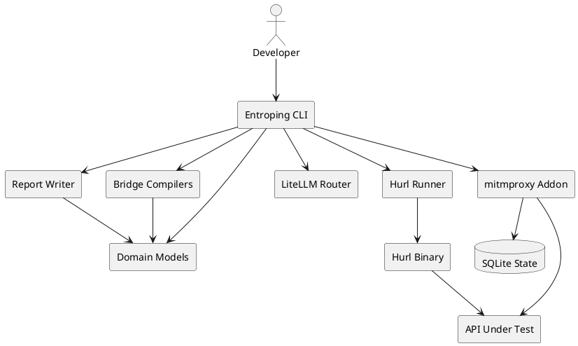

# Architecture

Entroping uses Ports and Adapters. The domain layer defines data structures and pure translation rules. Primary adapters accept user commands. Secondary adapters talk to tools, files, databases, proxies, and models.

## Package Boundaries

Rules:

- `models` imports no adapters.
- `bridge` imports `models` and pure utilities only.
- `cli`, `core`, `brain`, and `studio` depend inward.
- Hurl execution is isolated behind `core`.
- LLM calls are isolated behind `brain`.

## Runtime Governance Flow

## PlantUML Component Source

More diagrams live in [[docs/architecture/DIAGRAMS|DIAGRAMS]].

