# Entroping Diagrams

**Contract version:** 4.1
**Product maturity:** Alpha

This file contains Mermaid and PlantUML diagrams that can be copied into compatible renderers.

## 1. Product System Context

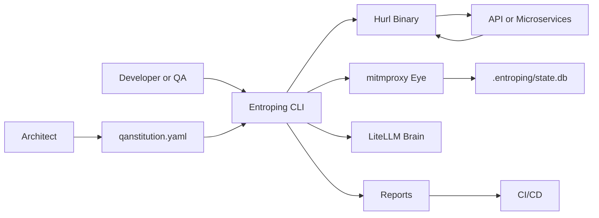

## 2. Hexagonal Architecture

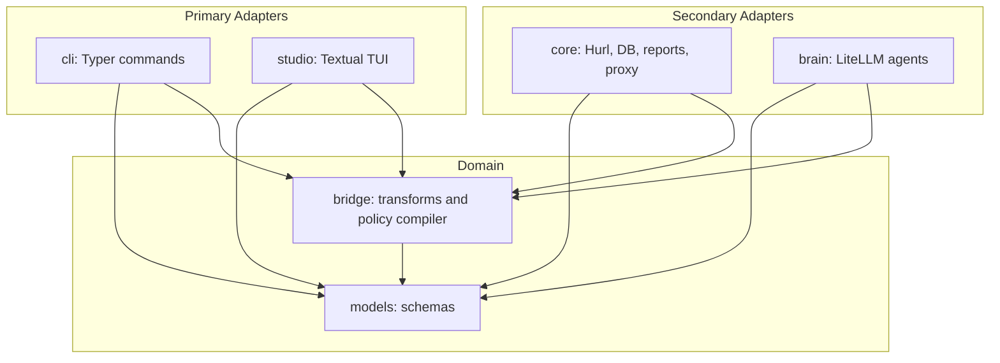

## 3. Command Lifecycle

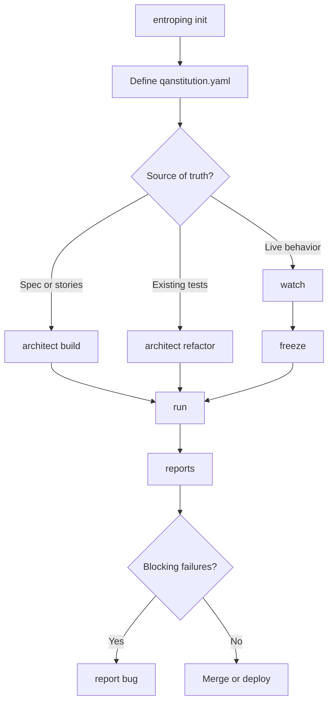

## 4. Architect Build Sequence

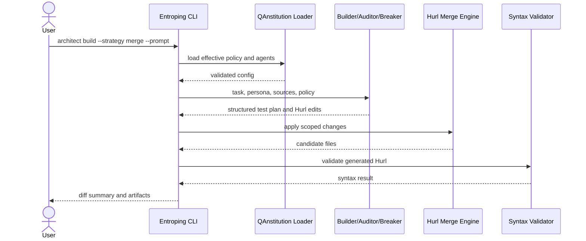

## 5. Run and Gate Injection Sequence

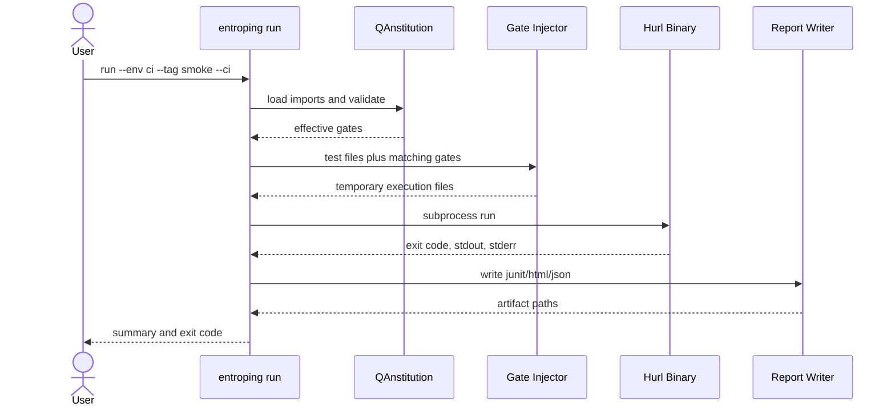

## 6. Eye Observation Flow

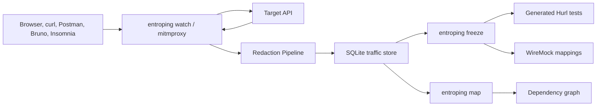

## 7. Multi-Repo Governance

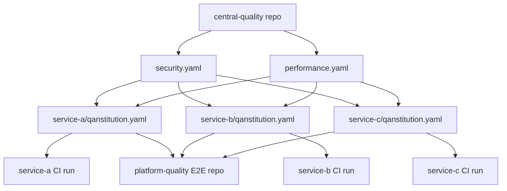

## 8. Test Diamond

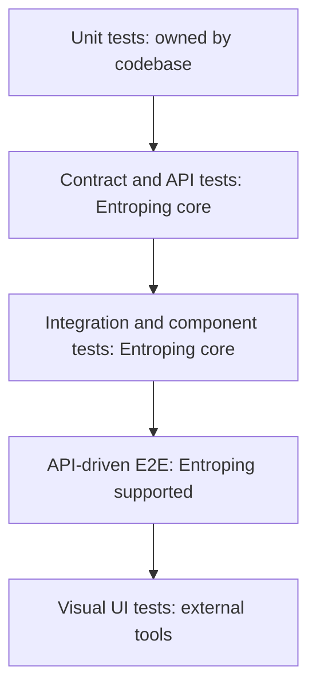

## 9. PlantUML Component Diagram

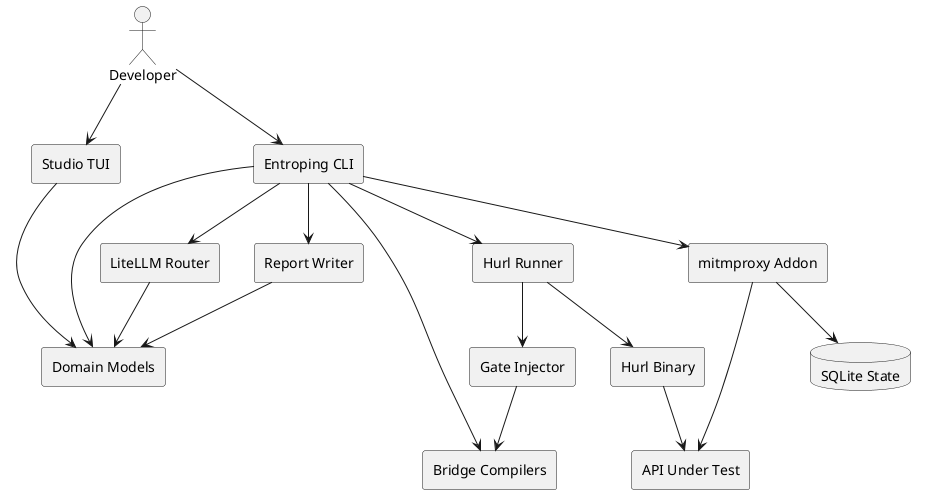

## 10. PlantUML Run Sequence

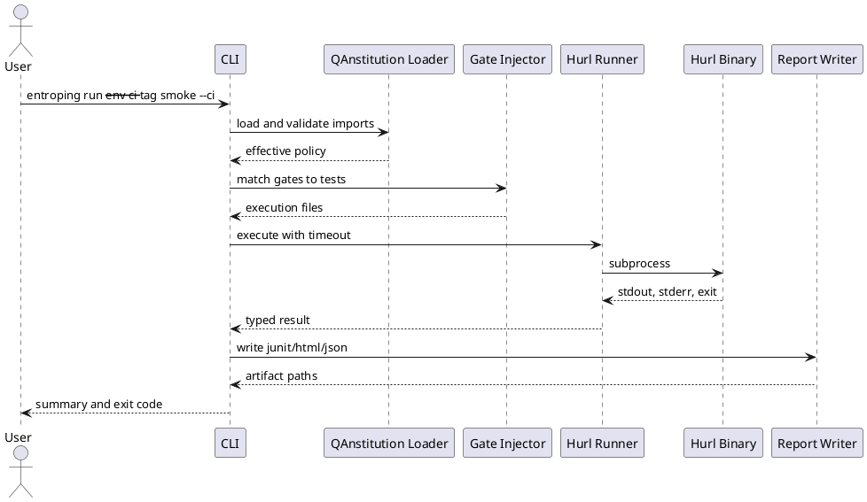

## 11. PlantUML Legacy Rescue Activity

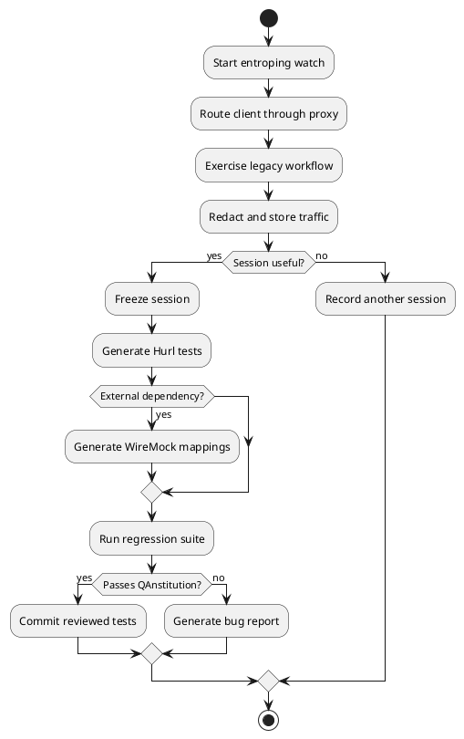

## 12. PlantUML Deployment View

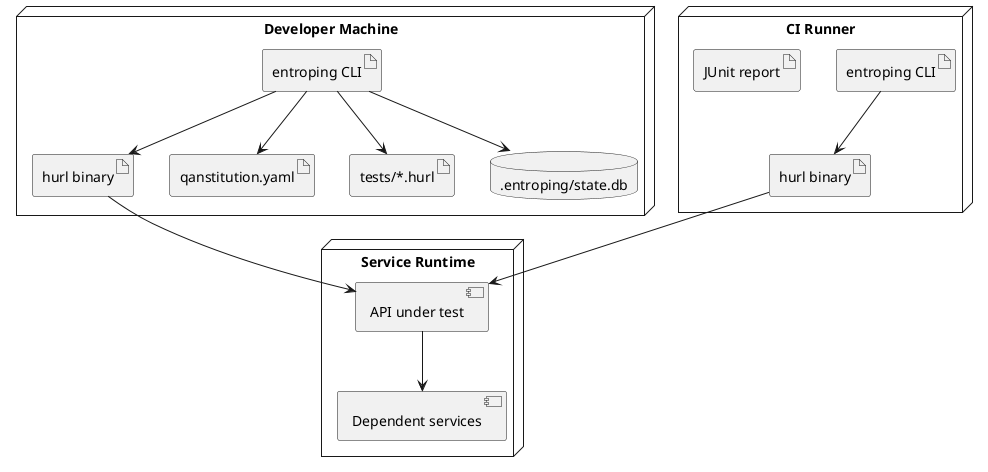
