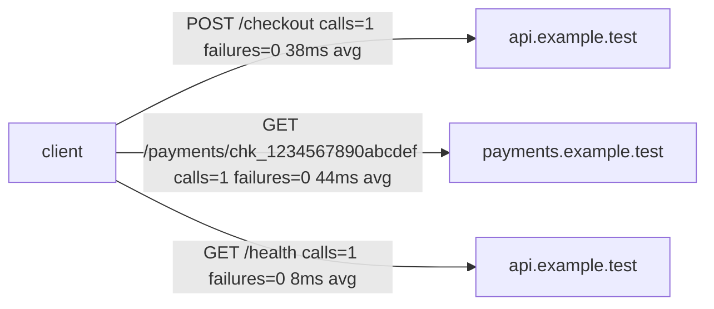

# Dependency Map Example

This example was generated through the same Markdown renderer used by
`entroping map --export md`, after seeding local `.entroping/state.db` with
redacted traffic records. It demonstrates the public shape without committing
local runtime state or generated `reports/` artifacts.

```markdown
# Entroping Dependency Map

| Host | Method | Path | Calls | Failures | Min ms | Avg ms | Max ms |
| --- | --- | --- | ---: | ---: | ---: | ---: | ---: |
| api.example.test | POST | /checkout | 1 | 0 | 38 | 38 | 38 |
| payments.example.test | GET | /payments/chk_1234567890abcdef | 1 | 0 | 44 | 44 | 44 |
| api.example.test | GET | /health | 1 | 0 | 8 | 8 | 8 |
```



## External Screenshot Path

When Graphviz is installed, capture a PNG from a real local traffic state:

```bash
entroping map --export png
open reports/dependency-map.png
```

Keep the generated PNG out of Git unless it is intentionally curated and
size-checked for a launch post.
