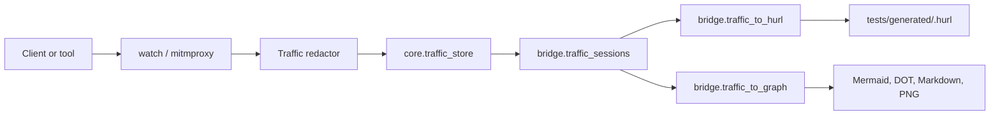

# Freeze and Map Implementation Plan

This plan defines the post-`watch` Eye work so `freeze` and `map` stay small,
testable, and separate from capture.

## Goal

Turn redacted observed traffic into two deterministic outputs:

- Hurl regression tests through `entroping freeze`.
- Dependency graph exports through `entroping map`.

The plan intentionally keeps `watch` as capture-only. `watch` records redacted
traffic; it does not generate Hurl, infer sessions, or write maps.

## Boundary Decision

The Eye pipeline has five boundaries:

| Boundary | Owner | Responsibility | Must Not Do |
| --- | --- | --- | --- |
| Capture | `core.traffic_proxy` | Convert mitmproxy flows into redacted `TrafficExchange` records | Generate Hurl, call Brain, export graphs |
| Persistence | `core.traffic_store` | Store and list redacted traffic records from `.entroping/state.db` | Accept unredacted records, infer tests |
| Session/filter | `bridge.traffic_sessions` | Filter noise and group traffic into named user-flow candidates | Read SQLite directly, write files |
| Hurl compiler | `bridge.traffic_to_hurl` | Convert redacted session records into Hurl models/content | Start proxy, call Hurl, call Brain |
| Graph compiler | `bridge.traffic_to_graph` | Convert traffic records into dependency graph models/exports | Read SQLite directly, render UI |

CLI commands orchestrate these boundaries:

- `freeze` reads redacted records through the store, asks bridge modules to
  filter/session/compile, then writes generated Hurl files.
- `map` reads redacted records through the store, asks bridge modules to build a
  graph, then writes or prints the requested export.

## Data Flow

## Session and Filtering Rules

MVP filtering should be deterministic and conservative:

- Ignore static asset extensions: `.css`, `.js`, `.map`, `.png`, `.jpg`,
  `.jpeg`, `.gif`, `.svg`, `.ico`, `.webp`, `.woff`, `.woff2`, `.ttf`.
- Ignore common telemetry hosts when explicitly configured later; do not ship a
  broad hardcoded ad-tech blocklist in MVP.
- Keep binary bodies as size-only records; do not emit binary payloads into Hurl
  or maps.
- Keep failed responses in session candidates. They are useful regressions.
- Preserve call order by `captured_at`, then store insertion order when exposed.
- Treat `--target` host as the system under test when it is available; other
  hosts become external dependencies for map/future mocks.

MVP session selection can start with one explicit flow:

- `freeze --name checkout_flow` compiles the latest filtered records into
  `tests/generated/checkout_flow.hurl`.
- A later issue can add first-class `traffic_session` rows, explicit session
  IDs, and manual session selection.

## Freeze Rules

`entroping freeze --name <flow>` should generate one Architect-owned Hurl file.

Generation rules:

- Output path is `tests/generated/<safe-flow-name>.hurl`.
- Reject absolute names, traversal, path separators, control characters, empty
  names, and names that normalize to hidden files.
- Mark generated files with `# entroping: source=traffic`.
- Include `# entroping: tags=traffic,freeze` by default.
- Emit requests in observed order.
- Use redacted request headers and redacted textual bodies only.
- Omit secrets and binary payload text.
- Compile only from `TrafficExchange.redacted == true` records.
- Validate generated Hurl with the parser-backed Hurl validator before writing.
- Use staged file writes and refuse unsafe symlinks or paths outside
  `tests/generated/`.

`--golden` should add stable assertions only:

- Status code.
- Content type when present.
- Optional body predicates only for stable scalar values.
- No assertions for token-like, ID-like, timestamp-like, or explicitly redacted
  fields.

`--mock <service>` remains a later implementation after basic freeze works.
Mock output must never write unredacted dependency secrets into mappings.

## Map Rules

`entroping map --export <fmt>` reads redacted traffic and emits a host-level
graph first. Service-level inference can come later.

MVP graph fields:

- Source node: `client` or configured target service.
- Destination host.
- Method.
- Path template candidate.
- Call count.
- Failure count by status code >= 400.
- Approximate latency summary when duration is available.

Supported outputs:

- `mermaid`: escaped `flowchart LR`.
- `md`: Markdown table plus embedded Mermaid block.
- `dot`: DOT text with escaped labels.
- `png`: only when a renderer is available; otherwise fail with an actionable
  message.

Graph export must escape labels because hosts, paths, and methods come from
traffic.

## Required Tests Before Implementation

Before `freeze` and `map` are considered implemented, add these tests:

| Area | Required Coverage |
| --- | --- |
| Filtering | Static assets ignored, failed API calls retained, binary body text omitted |
| Sessioning | Ordered grouping from redacted traffic, empty-state behavior, target-host split |
| Freeze compiler | Redacted traffic to valid Hurl, stable golden assertions, generated metadata |
| Freeze CLI | Missing state, unsafe `--name`, safe staged write, parser validation failure |
| Map compiler | Host graph aggregation, failure counts, latency summaries, escaping |
| Map CLI | Empty state, unsupported export, missing PNG renderer, stdout/file behavior |
| Security | No raw secret in Hurl, maps, mocks, CLI errors, reports, or fixtures |
| Architecture | Bridge modules do not import `core`, `cli`, `brain`, `studio`, or LiteLLM |

## Security and Privacy Risks

- Redacted traffic can still contain business-sensitive structure. Keep it local
  under `.entroping/` unless the user explicitly exports it.
- Generated Hurl files are committed artifacts. They must not contain secrets,
  cookies, bearer tokens, API keys, or raw credential-like query/body fields.
- Map exports can reveal internal hostnames and dependency topology. Treat them
  as review artifacts, not public marketing material by default.
- Mock mappings can accidentally preserve upstream credentials or customer data.
  Do not implement `--mock` until the redaction and fixture tests cover mappings.
- AI may use redacted traffic later, but no raw captured traffic should be sent
  to Brain/LiteLLM providers.

## Implementation Issue Set

The next implementation issues are small and sequential:

1. [#66 Eye: traffic filtering and session candidates](https://github.com/sakibshuvo/Entroping/issues/66).
2. [#67 Freeze: redacted traffic-to-Hurl compiler](https://github.com/sakibshuvo/Entroping/issues/67).
3. [#68 Freeze: CLI workflow and safe generated writes](https://github.com/sakibshuvo/Entroping/issues/68).
4. [#69 Map: dependency graph compiler and exports](https://github.com/sakibshuvo/Entroping/issues/69).

Each issue should ship with tests and documentation updates before merge.
